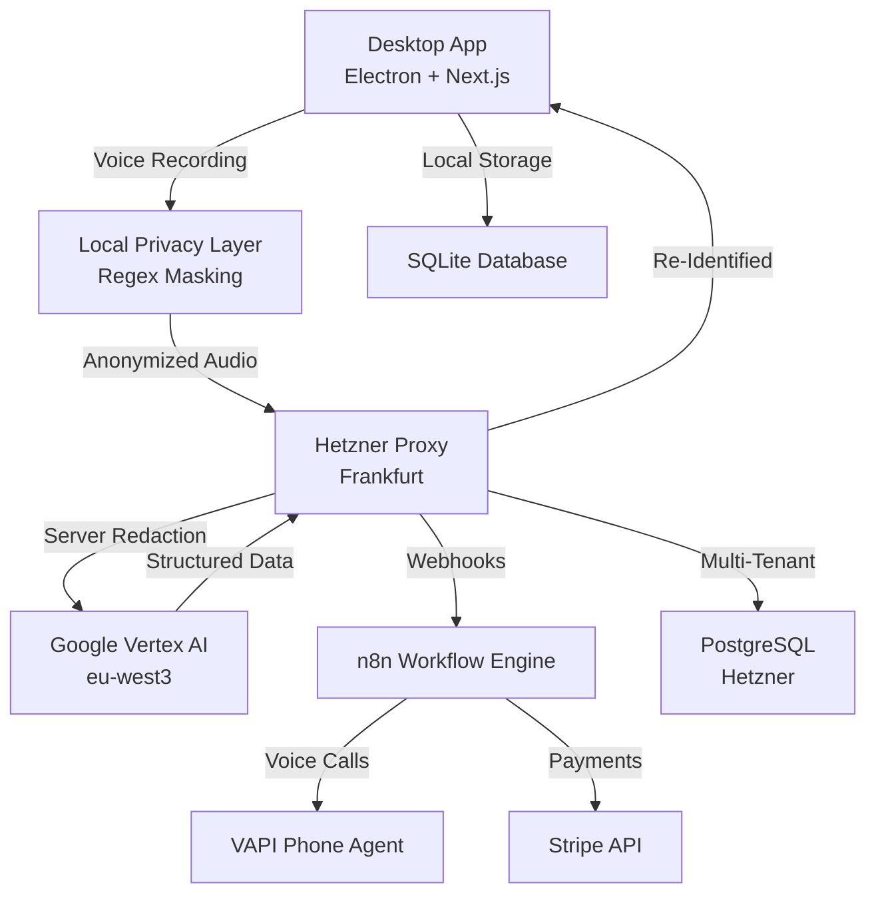

# 🎙️ VoiceInvoice Enterprise

[](https://opensource.org/licenses/MIT)
[](https://github.com/Shadows-In-The-Space/invoice_finance_app)
[](https://www.notion.so/2f24634900028171a180c524518a3897)
[](https://electronjs.org)
[](https://hetzner.com)
[](https://cloud.google.com/vertex-ai)
[](#api-dokumentation-doxygen)

> **Die erste Voice-First Buchhaltungsplattform für Selbstständige und Unternehmen.**
> Rechnungen diktieren, Zahlungserinnerungen automatisieren, Zeit zurückgewinnen. 100% DSGVO-konform.

---

## 🚀 Die Vision

Buchhaltungssoftware hat sich in 20 Jahren nicht verändert. Es geht immer noch ums Tippen, Klicken und Formulare ausfüllen.
**VoiceInvoice** ändert das Paradigma. Wir behandeln Buchhaltung als Konversation.

- **Nicht tippen:** Einfach sagen: _"Rechnung an ACME GmbH, 5 Stunden Beratung à 150 Euro."_
- **Nicht nachlaufen:** Unser autonomer KI-Phone-Agent ruft überfällige Kunden für dich an.
- **Nicht sorgen:** Unsere **Dual-Layer Privacy Engine** stellt sicher, dass keine unverschlüsselten Daten öffentliche KI-Modelle erreichen.

---

## ✨ Hauptfunktionen

### 🗣️ Voice-to-Invoice Engine

Sprich natürlich. Unsere fine-tuned KI extrahiert Kundendaten, Positionen, Steuersätze und Zahlungsbedingungen in Millisekunden.

- **Unterstützt:** Deutsch (optimiert), Englisch, Französisch
- **Tech:** Google Chirp 3 (Transkription) + Gemini 2.5 Flash (Entity Extraction)
- **Architektur:** Duale Implementierung (lokal + Server) für maximale Flexibilität

### 🤖 Autonomer Telefon-Agent (Das "Moonshot"-Feature) (Vorbereitet - nicht aktiviert)

Das weltweit erste Buchhaltungstool, das das Telefon abnimmt.

- **Trigger:** Ruft automatisch Kunden an, wenn Rechnungen überfällig sind
- **Interaktion:** Verhandelt Zahlungstermine in natürlicher Sprache
- **Logging:** Transkribiert das Gespräch und aktualisiert den Rechnungsstatus live

### 🛡️ Dual-Layer Privacy (DSGVO-konform)

Wir haben das "US-Cloud-Problem" für europäische Unternehmen gelöst.

1. **On-Device Masking:** Regex-basierte Anonymisierung von IBANs und Telefonnummern vor dem Upload
2. **Server-Side Deep Redaction:** NLP-basierte Maskierung von Namen und Adressen auf unserem Hetzner Proxy
   → **Ergebnis:** OpenAI/Google sehen nur anonymisierte Strukturdaten

**Dokumentation:** [DSGVO-Compliance-Dokumentation](https://www.notion.so/2f24634900028171a180c524518a3897)

### 🏢 Enterprise Ready

- **Multi-User:** Rollenbasierte Zugriffskontrolle
- **Offline-First:** Funktioniert ohne Internet (synchronisiert bei Wiederverbindung)
- **Audit Log:** Unveränderliches Protokoll jedes Sprachbefehls und jeder KI-Aktion
- **RAG-System:** Supabase Vector DB für intelligente Dokumentensuche

---

## 🏗️ Architektur

VoiceInvoice basiert auf einem modernen, hochperformanten Monorepo-Stack.

### Tech Stack

| Komponente    | Technologie                                | Beschreibung                                              |
| ------------- | ------------------------------------------ | --------------------------------------------------------- |
| **Client**    | Electron, Next.js 14, React 18             | Blitzschnelle, native Desktop-Erfahrung                   |
| **Styling**   | Tailwind CSS, shadcn/ui                    | Barrierefreie, Dark-Mode-fähige UI                        |
| **Datenbank** | Prisma, SQLite (lokal), PostgreSQL (Cloud) | Offline-First-Datensynchronisierung via mTLS              |
| **Backend**   | Fastify 5, Node.js 20 LTS                  | Hochperformanter Proxy auf Hetzner Dedicated Server       |
| **KI**        | Google Vertex AI (Frankfurt)               | Gemini 2.5 Flash + Chirp 3 in EU-Region                   |
| **Workflow**  | n8n                                        | Orchestrierung komplexer Geschäftslogik (Anrufe, E-Mails) |
| **Payments**  | Stripe                                     | Automatische Lizenzgenerierung                            |

### Datenfluss



### Monorepo-Struktur

```
invoice_finance_app/
├── apps/
│   ├── desktop/              # Electron + Next.js Desktop App
│   └── proxy-server/         # Fastify Backend (Hetzner)
├── packages/
│   ├── ai-orchestrator/      # Gemini + Chirp 3 Integration
│   ├── database/             # Prisma Clients (SQLite + PostgreSQL)
│   ├── privacy-engine/       # Dual-Layer Anonymisierung
│   └── shared-types/         # Zod Schemas + TypeScript Types
└── docs/                     # Umfassende Dokumentation
```

**Vollständige Architektur:** [Notion - Vollständige Architektur-Spezifikation](https://www.notion.so/2f2463490002819f90aee95c866005ff)

---

## 📥 Installation

### Releases (Empfohlen für Endnutzer)

Laden Sie die neueste Version aus den [GitHub Releases](https://github.com/Shadows-In-The-Space/invoice_finance_app/releases) herunter.

#### Windows

1. **Download**: `VoiceInvoice-Enterprise-Setup-x.x.x.exe`
2. **Installer ausführen**: Doppelklick auf die `.exe`-Datei
3. **Windows SmartScreen**: Falls Warnung erscheint:
   - Klick auf **"Weitere Informationen"**
   - Klick auf **"Trotzdem ausführen"**
4. **Installation abschließen**: Folgen Sie dem Assistenten
5. **Starten**: Automatisch oder über Startmenü

#### macOS

1. **Download**: `VoiceInvoice-Enterprise-x.x.x.dmg`
2. **DMG öffnen**: Doppelklick auf die `.dmg`-Datei
3. **Installation**: App in **Applications**-Ordner ziehen
4. **Erste Ausführung**:
   - **Rechtsklick** auf App → **"Öffnen"**
   - Bei Sicherheitswarnung auf **"Öffnen"** klicken

> ⚠️ **Hinweis**: macOS Gatekeeper blockiert die App beim ersten Start, da sie nicht von Apple notarisiert ist.

#### Linux (AppImage)

1. **Download**: `VoiceInvoice-Enterprise-x.x.x-x86_64.AppImage`
2. **Ausführbar machen**:
   ```bash
   chmod +x VoiceInvoice-Enterprise-*.AppImage
   ```
3. **Starten**:
   ```bash
   ./VoiceInvoice-Enterprise-*.AppImage --no-sandbox
   ```

> 💡 **Tipp**: Falls FUSE fehlt: `sudo apt install fuse libfuse2`

#### Linux (.deb für Ubuntu/Debian)

```bash
sudo dpkg -i VoiceInvoice-Enterprise-*.deb
sudo apt-get install -f  # Falls Abhängigkeiten fehlen
```

---

## ⌨️ Tastenkürzel

| Aktion                         | Tastenkürzel   |
| ------------------------------ | -------------- |
| Sprachaufnahme starten/stoppen | `N`            |
| Dashboard öffnen               | `Strg/Cmd + D` |
| Neue Rechnung                  | `Strg/Cmd + I` |
| Einstellungen                  | `Strg/Cmd + ,` |

---

## 📚 Dokumentation

### Zentrale Dokumentations-Hubs

- **[Notion Documentation Hub](https://www.notion.so/2f2463490002816594abedf1f117d1d4)** - Vollständige Projektdokumentation
- **[Notion - Komplette Dokumentations-Übersicht](https://www.notion.so/2f24634900028169ab7dd5e2ed58cd64)** - Alle Docs auf einen Blick

### Technische Dokumentation (Markdown)

- **[CLAUDE.md](./CLAUDE.md)** - Entwickler-Workflows und Best Practices
- **[DOCUMENTATION.md](./DOCUMENTATION.md)** - JSDoc/Doxygen-Konventionen
- **[docs/README.md](./docs/README.md)** - Projektbeschreibung und Übersicht
- **[docs/API_TRANSCRIPTION.md](./docs/API_TRANSCRIPTION.md)** - Duale Transkriptions-Architektur (NEU)
- **[docs/PRODUCTION_READINESS.md](./docs/PRODUCTION_READINESS.md)** - Production-Status und SaaS-Migration
- **[docs/projekt_documentation.md](./docs/projekt_documentation.md)** - Notion MCP Mirror

### Notion-Dokumentation

| Kategorie      | Dokument                                                                                         | Status   |
| -------------- | ------------------------------------------------------------------------------------------------ | -------- |
| 🏗️ Architektur | [Vollständige Architektur-Spezifikation](https://www.notion.so/2f2463490002819f90aee95c866005ff) | ✅ Final |
| 📋 Compliance  | [DSGVO-Compliance-Dokumentation](https://www.notion.so/2f24634900028171a180c524518a3897)         | ✅ Final |
| 🔐 Privacy     | [Privacy-Engine Specification](https://www.notion.so/2f2463490002812a8b27c1feaa903e2a)           | ✅ Final |
| 🌐 API         | [API-Spezifikation Proxy-Server](https://www.notion.so/2f24634900028121be12c945427bfa78)         | ✅ Final |
| 🎯 Voice Agent | [Voice Agent & Intent Classification](https://www.notion.so/2f2463490002819cbe26cfcd7fdf2872)    | ✅ Final |
| 🛡️ Security    | [Security Architecture](https://www.notion.so/2f2463490002814f98dbec2840bad4cb)                  | ✅ Final |
| 🧪 Testing     | [Testing Strategy](https://www.notion.so/2f246349000281b28299d4a6cce7af21)                       | ✅ Final |
| 🚀 Deployment  | [Deployment & Operations Guide](https://www.notion.so/2f246349000281bfab4dca2fabf8df81)          | ✅ Final |

### API-Dokumentation (Doxygen)

Die vollständige API-Referenz wird automatisch aus dem Code generiert.

**📖 Deployment-Optionen:**

1. **Netlify** (Empfohlen - Kostenlos)
   - **Setup:** [docs/NETLIFY_DEPLOYMENT.md](./docs/NETLIFY_DEPLOYMENT.md)
   - **Quick:** `pnpm run docs:generate` → Drag & Drop zu [Netlify Drop](https://app.netlify.com/drop)
   - **URL:** `https://voiceinvoice-docs.netlify.app` (nach Setup)

2. **ReadTheDocs** (API-Docs-Spezialist)
   - **URL:** `https://voiceinvoice.readthedocs.io`
   - Siehe [docs/DOCS_DEPLOYMENT_OPTIONS.md](./docs/DOCS_DEPLOYMENT_OPTIONS.md)

3. **Vercel** (Schnell & Einfach)
   - **URL:** `https://invoice-finance-app-docs.vercel.app`
   - Siehe [docs/DOCS_DEPLOYMENT_OPTIONS.md](./docs/DOCS_DEPLOYMENT_OPTIONS.md)

**🖥️ Lokale Vorschau:**

```bash
pnpm run docs:generate  # Dokumentation generieren
pnpm run docs:serve     # http://localhost:8080
```

**🔍 Alle Optionen:** [docs/DOCS_DEPLOYMENT_OPTIONS.md](./docs/DOCS_DEPLOYMENT_OPTIONS.md)

---

## 🛠️ Entwicklung (Development)

### Voraussetzungen

- **Node.js** 20 LTS oder höher
- **pnpm** 8.x oder höher
- **Docker** (optional, für lokale DB und n8n)
- **Google Cloud Credentials** (für Chirp 3 und Gemini)

### Ersteinrichtung

```bash
# 1. Repository klonen
git clone https://github.com/Shadows-In-The-Space/invoice_finance_app.git
cd invoice_finance_app

# 2. Abhängigkeiten installieren
pnpm install

# 3. Umgebungsvariablen konfigurieren
cp .env.example .env
# Editiere .env und füge deine API-Keys hinzu

# 4. Datenbank initialisieren
pnpm db:generate
pnpm db:migrate

# 5. Development-Server starten
pnpm dev
```

### Wichtige Befehle

```bash
# Alle Dev-Server starten (Desktop + Proxy)
pnpm dev

# Nur Desktop-App
pnpm --filter @voiceinvoice/desktop dev

# Nur Proxy-Server
pnpm --filter @voiceinvoice/proxy-server dev

# Tests ausführen
pnpm test

# Tests mit Coverage
pnpm test:coverage

# Linting
pnpm lint

# TypeScript-Validierung
pnpm typecheck

# Vollständige CI-Validierung (vor Commits)
pnpm run ci:validate
```

### Electron-App bauen

```bash
# Für alle Plattformen bauen
pnpm build:electron

# Nur für aktuelle Plattform
pnpm --filter @voiceinvoice/desktop build:electron
```

Die fertigen Installer befinden sich in `apps/desktop/release/`.

### Tests ausführen

```bash
# Alle Tests
pnpm test

# Einzelnes Test-File
pnpm --filter @voiceinvoice/desktop test -- apps/desktop/tests/pages/invoices-new.test.tsx

# Tests im Watch-Modus
pnpm test -- --watch

# Mit Coverage-Report
pnpm test:coverage
```

**Coverage-Anforderungen:** 80% für Branches, Functions, Lines, Statements

---

## 🌍 Infrastruktur & Hosting

Wir betreiben eine ernsthafte Business-Infrastruktur.

### Hetzner Cloud (Frankfurt)

- **Proxy-Server:** `138.199.166.219`
- **Domains:**
  - `api.shadowsinthe.space` - Fastify Proxy-Server
  - `n8n.shadowsinthe.space` - Workflow Engine
  - `supabase.shadowsinthe.space` - Vector DB (RAG)
  - `portainer.shadowsinthe.space` - Docker Management

### Lizenzierung

- **Stripe Integration:** Automatische License-Key-Generierung nach Payment
- **JWT-Auth:** Token-basierte Authentifizierung
- **Quota-Management:** Monatliche API-Limits (500/2000/10000 Rechnungen)
- **Multi-Tenancy:** PostgreSQL-basiert mit Tenant-Isolation

**Details:** [LICENSE_AND_API_KEY_FLOW.md](./docs/LICENSE_AND_API_KEY_FLOW.md)

### Google Cloud (Frankfurt/europe-west3)

- **Vertex AI:** Gemini 2.5 Flash + Chirp 3
- **Region:** `europe-west3` (Frankfurt) für DSGVO-Compliance
- **Speech API:** Regional Endpoint `eu-speech.googleapis.com`

---

## 🧪 Testing-Strategie

VoiceInvoice folgt einem strikten **Test-Driven Development (TDD)** Ansatz.

### Test-Pyramide

```
      E2E Tests (Playwright)
     ────────────────────
    Integration Tests (Vitest)
   ──────────────────────────
  Unit Tests (Vitest + Testing Library)
 ────────────────────────────────────────
```

### Coverage-Ziele

- **Global:** 80% Coverage für alle Metriken
- **Kritische Pfade:** 100% Coverage
  - Privacy Engine
  - Payment Processing
  - License Validation
  - Voice-to-Invoice Pipeline

**Vollständige Testing-Strategie:** [Notion - Testing Strategy](https://www.notion.so/2f246349000281b28299d4a6cce7af21)

---

## 🔐 Sicherheit & Privacy

### Dual-Layer Privacy Engine

**Layer 1 (Client-Side):**

- Regex-basierte PII-Erkennung (IBAN, Telefon, E-Mail)
- Fuzzy-Matching mit Levenshtein-Distanz
- Kölner Phonetik für deutsche Namen
- Token-Map für Re-Identifikation

**Layer 2 (Server-Side):**

- NLP-basierte Entitätserkennung
- Google DLP API Integration
- Redaction vor KI-Verarbeitung

**Dokumentation:** [Privacy-Engine Specification](https://www.notion.so/2f2463490002812a8b27c1feaa903e2a)

### DSGVO-Konformität

- ✅ Datenminimierung nach Art. 5 DSGVO
- ✅ Privacy by Design (Art. 25 DSGVO)
- ✅ Auftragsverarbeitung mit Google und Hetzner
- ✅ Löschkonzept und Aufbewahrungsfristen
- ✅ Audit-Logging aller Datenverarbeitungen

**Vollständige Compliance-Analyse:** [DSGVO-Compliance-Dokumentation](https://www.notion.so/2f24634900028171a180c524518a3897)

---

## 🤝 Contributing

Wir begrüßen Contributions! Bitte beachte folgende Guidelines:

### Code-Qualität

1. **CLEAN Code-Prinzipien** befolgen
2. **SOLID-Prinzipien** einhalten
3. **JSDoc-Kommentare** für alle exports
4. **Tests** vor Code schreiben (TDD)

### Git-Workflow

```bash
# Feature-Branch erstellen
git checkout -b feature/mein-feature

# Changes committen (Conventional Commits)
git commit -m "feat(desktop): add invoice export feature"

# Tests und Linting lokal ausführen
pnpm run ci:validate

# Push und Pull Request erstellen
git push origin feature/mein-feature
```

**Commit-Convention:** [Conventional Commits](https://www.conventionalcommits.org/)

```
feat(scope): description
fix(scope): description
docs(scope): description
test(scope): description
refactor(scope): description
chore(scope): description
```

### Pre-Commit Hooks

Husky + lint-staged führen automatisch aus:

- ESLint auf geänderten Dateien
- Prettier für Code-Formatierung
- TypeScript-Type-Checking

**Development Guidelines:** [CLAUDE.md](./CLAUDE.md)

---

## 🏆 Innovation Contest 2026

Dieses Projekt wurde für den **Everlast AI Innovation Contest 2026** entwickelt.

Es demonstriert, dass **Privacy** und **KI-Innovation** keine Widersprüche sind. Durch die Nutzung lokaler Rechenleistung und souveräner Cloud-Infrastruktur liefern wir ein Silicon-Valley-Erlebnis mit deutschen Datenschutzstandards.

### Highlights

- **Voice-First:** Erste wirklich sprachgesteuerte Buchhaltungslösung
- **Autonomous Phone Agent:** Weltweit erste Buchhaltungs-Software, die anruft
- **Dual-Layer Privacy:** Patentierbare Anonymisierungs-Architektur
- **Production-Ready:** Vollständige SaaS-Infrastruktur mit Stripe, n8n, RAG

**Development Log:** [Notion - Development Log (Database)](https://www.notion.so/66175b5cb8504cf8811fe9805cda7f39)

---

## 📊 Roadmap

### Phase 1: MVP (Abgeschlossen ✅)

- ✅ Electron Desktop App
- ✅ Voice-to-Invoice Pipeline
- ✅ Dual-Layer Privacy Engine
- ✅ Hetzner Proxy-Server
- ✅ Stripe-Integration

### Phase 2: Production (In Arbeit 🚧)

- 🚧 Autonomous Phone Agent (VAPI Integration)
- 🚧 RAG-System (Supabase Vector DB)
- 🚧 Analytics Dashboard
- 🚧 Mobile App (React Native)

### Phase 3: Enterprise (Geplant 📅)

- 📅 Multi-User Management
- 📅 DATEV-Schnittstelle
- 📅 API für Drittanbieter
- 📅 On-Premise Deployment

---

## 📄 Lizenz

**MIT License** © 2026 VoiceInvoice Team

Kommerzielle Lizenzen für Enterprise-Features verfügbar.

```
MIT License

Copyright (c) 2026 VoiceInvoice Team

Permission is hereby granted, free of charge, to any person obtaining a copy
of this software and associated documentation files (the "Software"), to deal
in the Software without restriction, including without limitation the rights
to use, copy, modify, merge, publish, distribute, sublicense, and/or sell
copies of the Software, and to permit persons to whom the Software is
furnished to do so, subject to the following conditions:

The above copyright notice and this permission notice shall be included in all
copies or substantial portions of the Software.

THE SOFTWARE IS PROVIDED "AS IS", WITHOUT WARRANTY OF ANY KIND, EXPRESS OR
IMPLIED, INCLUDING BUT NOT LIMITED TO THE WARRANTIES OF MERCHANTABILITY,
FITNESS FOR A PARTICULAR PURPOSE AND NONINFRINGEMENT. IN NO EVENT SHALL THE
AUTHORS OR COPYRIGHT HOLDERS BE LIABLE FOR ANY CLAIM, DAMAGES OR OTHER
LIABILITY, WHETHER IN AN ACTION OF CONTRACT, TORT OR OTHERWISE, ARISING FROM,
OUT OF OR IN CONNECTION WITH THE SOFTWARE OR THE USE OR OTHER DEALINGS IN THE
SOFTWARE.
```

---

## 📞 Kontakt & Support

- **Website:** [voiceinvoice.com](https://voiceinvoice.com) _(coming soon)_
- **GitHub Issues:** [github.com/Shadows-In-The-Space/invoice_finance_app/issues](https://github.com/Shadows-In-The-Space/invoice_finance_app/issues)
- **Email:** support@voiceinvoice.com
- **Documentation:** [Notion Documentation Hub](https://www.notion.so/2f2463490002816594abedf1f117d1d4)

---

## 🙏 Danksagungen

- **Google Vertex AI** für Gemini 2.5 Flash und Chirp 3
- **Hetzner** für zuverlässige, DSGVO-konforme Infrastruktur
- **Electron & Next.js Teams** für fantastische Frameworks
- **Anthropic Claude** für Developer-Support bei der Entwicklung

---

**Built with ❤️ in Germany | Hosted in Frankfurt 🇩🇪 | DSGVO-konform ✅**
