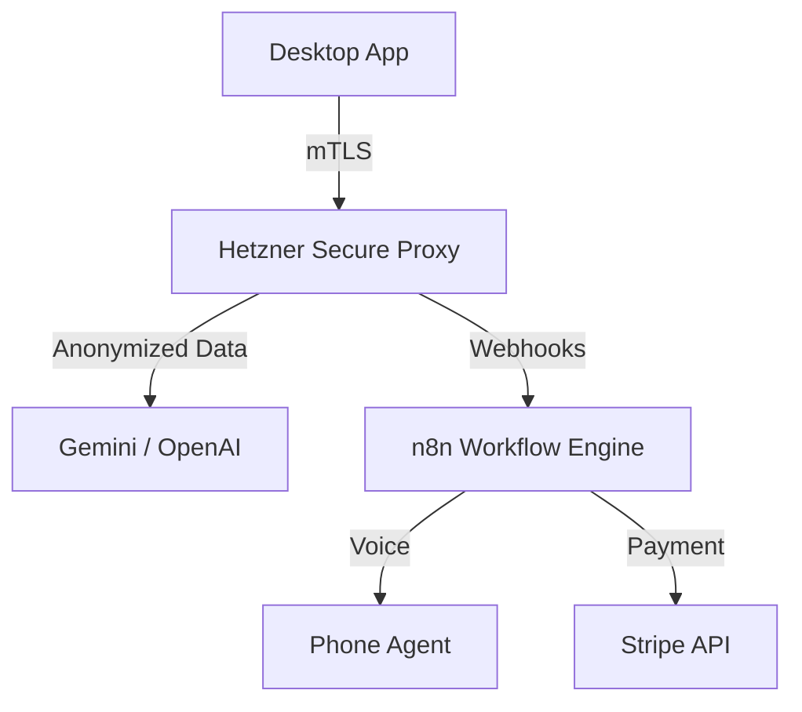

# 🎙️ VoiceInvoice Enterprise

[](https://opensource.org/licenses/MIT)
[](https://voiceinvoice.com)
[](https://voiceinvoice.com/privacy)
[](https://electronjs.org)
[](https://hetzner.com)

> **The first Voice-First Accounting Platform for the Enterprise.**
> Dictate invoices, automate dunning, and reclaim your time. 100% GDPR-compliant.

---

## 🚀 The Vision

Accounting software hasn't changed in 20 years. It's still about typing, clicking, and filling out forms.
**VoiceInvoice** changes the paradigm. We treat accounting as a conversation.

- **Don't type:** "Invoice to ACME Corp, 5 hours consulting at 150 euros."
- **Don't chase:** Let our autonomous AI Phone Agent call overdue customers for you.
- **Don't worry:** Our **Dual-Layer Privacy Engine** ensures no unmasked data ever touches public AI models.

---

## ✨ Key Features

### 🗣️ Voice-to-Invoice Engine

Speak naturally. Our fine-tuned AI extracts customer data, line items, tax rates, and payment terms in milliseconds.

- _Supports:_ German (optimized), English, French.
- _Tech:_ Google Chirp 3 + Gemini 2.5 Flash.

### 🤖 Autonomous Phone Agent (The "Moonshot")

The world's first accounting tool that picks up the phone.

- **Trigger:** Automatically calls customers when invoices are overdue.
- **Interaction:** Negotiates payment dates using natural language.
- **Logging:** Transcribes the call and updates the invoice status live.

### 🛡️ Dual-Layer Privacy

We solved the "US Cloud Problem" for European businesses.

1.  **On-Device Masking:** Regex-based redaction of IBANs and Phones before upload.
2.  **Server-Side Deep Redaction:** NLP-based masking of names and addresses on our Hetzner Proxy.
    -> **Result:** OpenAI/Google only ever see anonymized structural data.

### 🏢 Enterprise Ready

- **Multi-User:** Role-based access control.
- **Offline-First:** Works without internet (syncs when back online).
- **Audit Log:** Immutable log of every voice command and AI action.

---

## 🏗️ Architecture

VoiceInvoice is built on a modern, high-performance Monorepo stack.

| Component    | Tech Stack                                    | Description                                              |
| ------------ | --------------------------------------------- | -------------------------------------------------------- |
| **Client**   | Electron, Next.js 14, React Server Components | Blazing fast, native desktop experience.                 |
| **Styling**  | Tailwind CSS, shadcn/ui                       | Accessible, dark-mode ready UI.                          |
| **Data**     | Prisma, SQLite (Local), PostgreSQL (Cloud)    | Offline-first data syncing via mTLS.                     |
| **Backend**  | Fastify, Node.js                              | High-performance proxy hosted on **Hetzner Dedicated**.  |
| **Workflow** | n8n                                           | Orchestration of complex business logic (Calls, Emails). |



---

## 🛠️ Getting Started

### Prerequisites

- Node.js 20+
- pnpm
- Docker (for local DB and n8n)

### Installation

```bash
# 1. Clone the repo
git clone https://github.com/your-org/voiceinvoice.git

# 2. Install dependencies
pnpm install

# 3. Setup local environment
cp .env.example .env
pnpm db:migrate

# 4. Start development server
pnpm dev
```

### Building for Production

```bash
# Build desktop app (Linux/Mac/Windows)
pnpm build:electron
```

---

## 🌍 Infrastructure & Licensing

We run a serious business infrastructure.

- **Licensing:** Automated License Key minting via **Stripe Webhooks**.
- **Hosting:** All services run on isolated **Hetzner Cloud** instances in Frankfurt (Falkenstein/Nuremberg).
- **Webhooks:** Secure, HMAC-signed webhooks connect our n8n workflows with external providers (VAPI, Stripe).

---

## 🏆 Innovation Contest 2026

This project is submitted to the Innovation Contest 2026.
It demonstrates that **Privacy** and **AI Innovation** are not contradictions. By leveraging local computing power and sovereign cloud infrastructure, we deliver a Silicon-Valley-grade experience with German data protection standards.

---

## 📄 License

MIT © 2026 VoiceInvoice Team.
Commercial licenses available for Enterprise features.
